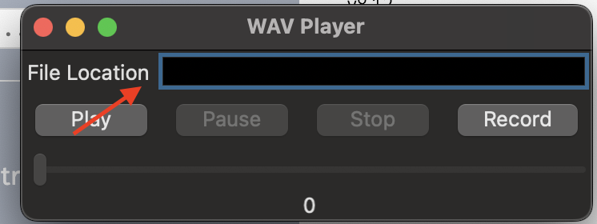

# **_WAV Player_**
### This program demonstrates the [RSound](https://docs.racket-lang.org/rsound/index.html) package, along with GUI applications in racket

## Purpose of this program:
This program is a simple program which plays WAV media files using the RSound Racket library.

## How to Run:
1. First, you must install the [RSound](https://docs.racket-lang.org/rsound/index.html) package. This can be done by running the following command in your terminal: 	"raco pkg install rsound" 
2. Additionally, you will need to install the [while-loop](https://docs.racket-lang.org/dyoo-while-loop/index.html) package which can be done by running the following command: "raco pkg install while-loop" 
3. Finally, the last package you will need can be installed is  [try-catch](https://docs.racket-lang.org/try-catch/index.html). This can be done by running: "raco pkg install try-catch"

Once you have these packages, you should be able to simply click the run button inside of DrRacket to open the program.

## How to Use:
1. Enter the path to the WAV file (It is very important that the file be a WAV file, this program will not work with any other media types) in the text box.
2. Click Play. The program should begin playing the audio file, and you should see a slider at the bottom which shows the time the song is currently at.
3. Clicking pause will cause the music to stop playing, but will you can resume it using the play button (The slider is disabled because I couldn't get it to auto-play if it was adjusted while the song was paused)
4. Clicking stop will stop the audio playback. If you click play, it will begin playing at the start of the file.
5. The slider can be adjusted while the song is playing to adjust the position the audio file is playing from.

## Important Note:
I've been made aware of an issue with running this application on Windows. There is a known bug with the PortAudio package which is downloaded automatically when you install RSound via the Racket pkg installer. The latest version of PortAudio fixed it, however, it isn't present in Racket's package library, so it needs to be installed manually. You can find the steps on installing it [here](https://www.portaudio.com/). Additionally, I have noticed some issues with running this program on Linux (I developed this program on MacOS so I hadn't noticed them). Depending on the linux install, this program will either work perfectly fine, or will give one of two errors:

* [Assertion #\<procedure:negative?\> failed on 0.0](https://github.com/jbclements/RSound/issues/47)
* [identifier `beginner-<=' not included in nested require spec in: lang/private/teachprims](https://github.com/jbclements/RSound/issues/51)

Both errors are known to the developers of RSound and I have added a link to their GitHub Issues pages. Unfortunately, neither seem to have a proper solution.
